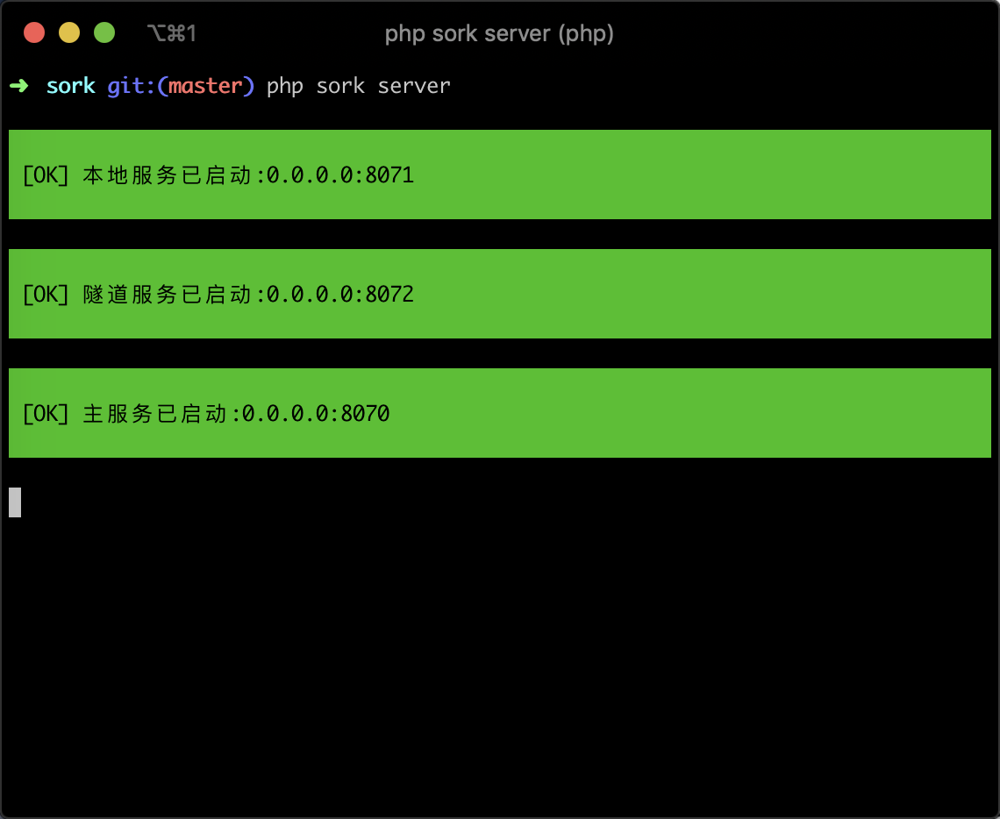

## Sork

基于 PHP + Swoole 实现的内网穿透工具。



## Usage

#### 在有公网ip的机器上面启动服务端

```
php sork server
```

默认会加载当前目录下面的 `server.json` 配置文件，内容如下：

```json
{
  "server": {
    "host": "0.0.0.0",
    "port": 8070
  },
  "tunnel": {
    "host": "0.0.0.0",
    "port": 8072
  },
  "listen": {
    "host": "0.0.0.0",
    "port": 8071
  }
}
```

这些都是默认的配置，可以不修改，当然如果存在端口冲突，那么自行修改，不过修改之后同时也需要修改客户端的配置。保持服务端的端口与客户端的端口一致。

#### 在本地启动客户端

```
php sork client
```

默认会加载当前目录下面的 `client.json` 配置文件，内容如下：

```json
{
  "server": {
    "host": "127.0.0.1",
    "port": 8070
  },
  "tunnel": {
    "host": "127.0.0.1",
    "port": 8072
  },
  "local": {
    "host": "0.0.0.0",
    "port": 3306
  }
}
```

这里你需要修改的是 `local.host` 和 `local.port` ，将它们改为你本地的服务。另外将 `server.host`，`server.port`，`tunnel.host`，`tunnel.port` 改为服务端的ip和端口。

这样的话，一个内网穿透服务就已经搭建完毕了。

## 支持

+ [x] HTTP
+ [x] MySQL
+ [ ] todo...

## 协议

**Sork** 采用 **MIT** 开源许可证，你可以在商业项目中免费使用 **Sork** 或者基于 **Sork** 二次开发而不必支付费用。